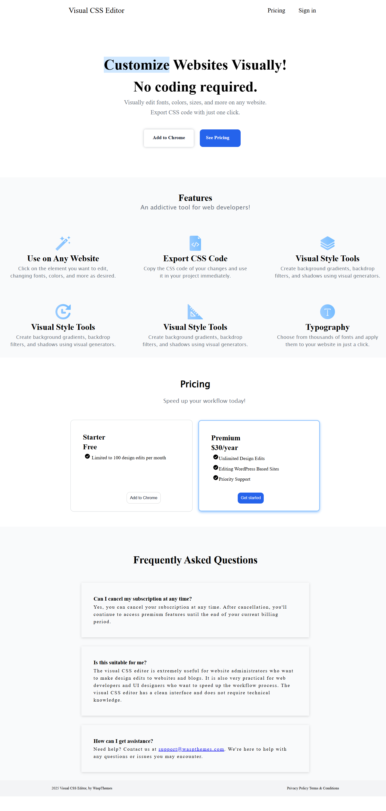

## Original Inspiration

This project is a clone of the [Visual CSS Editor](https://visualcsseditor.com/) —  
a Chrome extension that allows users to visually edit any website without writing code.

🔗 Visit the original tool: [https://visualcsseditor.com/](https://visualcsseditor.com/)

-------------------------------------------------------------------------------------------------
🔗 [Live Demo](https://visual-css-editor-clone.netlify.app/)

---------------------------------------------------------------------------------------------------

## 📸 Screenshot

 

---

